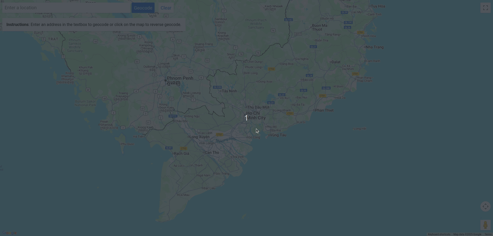

# WorldCast

This project is a Spring Boot application called **WorldCast**. It provides weather data and location information using external APIs (TomorrowIO, OpenStreetMap), with caching via Redis. The application is structured with REST controllers, service layers, and DTOs for clean separation of concerns.

## Features

- Fetch current and forecast weather data
- Geolocation services using OpenStreetMap
- Integration with TomorrowIO weather API
- Generate weather descriptions using GEMINI AI
- Redis caching for performance optimization
- Global exception handling
- Interactive Google Maps interface with resizable weather panel
- Real-time weather polling with AI-generated descriptions

## Tech Stack

### Backend

- **Spring Boot** - Application framework
- **Redis** - Caching response data of nearby weather locations

### Frontend - forked from [WorldCast-Frontend](https://github.com/googlemaps/js-samples/tree/sample-geocoding-simple)

- **TypeScript** - Programming language
- **Vite** - Build tool and development server
- **HTML5/CSS3** - Markup and styling
- **Google Maps JavaScript API** - Interactive maps

### External Services & APIs

- **TomorrowIO API** - Weather data provider
- **Google Gemini AI** - AI-powered weather descriptions
- **OpenStreetMap** - Geolocation services
- **Google Maps API** - Map visualization

## Prerequisites

- Docker
- Gemini API key
- TomorrowIO API key
- Google Maps API key

## Configuration

Before running the application, you need to configure the following:

1. **Get API Keys**

   - **Gemini AI API Key**: Get from [Google AI Studio](https://aistudio.google.com/apikey)
   - Pass the key as an environment variable `GEMINI_API_KEY` in `compose.yml`

   - **TomorrowIO API Key**: Get from [tomorrow.io](https://www.tomorrow.io/)
   - Pass the key as an environment variable `WEATHER_API_KEY` in `compose.yml`

   - **Google Maps API Key**: Get from [Google Cloud Console](https://console.cloud.google.com/)
   - Pass the key as an environment variable `VITE_GOOGLE_MAPS_API_KEY` in `compose.yml`

2. **Authenticate with Google Cloud (for Gemini AI)**

   ```bash
   gcloud auth application-default login
   ```

## Run Locally

Make sure you have redis on your machine on port 6379.

``` shell
chmod +x run.sh
./run.sh
```

## Run with Docker

1. **Clone the repository**

   ```bash
   git clone https://github.com/kiin21/Weather-Forecast
   cd WorldCast
   ```

2. **Copy credential file to source code**

   ```bash
   # On MacOS/Linux
   cp $HOME/.config/gcloud/application_default_credentials.json WorldCast-Backend/src/main/resources/service-account-key.json

   # On Windows
   copy %APPDATA%\gcloud\application_default_credentials.json WorldCast-Backend\src\main\resources\service-account-key.json
   ```

   Ensure the file is named `service-account-key.json` and placed in the `src/main/resources` directory of the backend project.

3. **Start with Docker Compose**

   ```bash
   docker-compose up -d
   ```

   This will start:

   - Redis instance (port 6379)
   - Spring Boot backend (port 8080)
   - Frontend application (port 5173)

4. **Access the application**
   - **Frontend**: `http://localhost:5173`
   - **Backend API**: `http://localhost:8080`

## API Endpoints

- `GET /weather?location={lat,lon}` - Get weather data for a specific location

## Demo



## New features


## License

MIT License

Copyright (c) 2025 Pham Dao Anh Khoa

Permission is hereby granted, free of charge, to any person obtaining a copy
of this software and associated documentation files (the "Software"), to deal
in the Software without restriction, including without limitation the rights
to use, copy, modify, merge, publish, distribute, sublicense, and/or sell
copies of the Software, and to permit persons to whom the Software is
furnished to do so, subject to the following conditions:

The above copyright notice and this permission notice shall be included in
all copies or substantial portions of the Software.

THE SOFTWARE IS PROVIDED "AS IS", WITHOUT WARRANTY OF ANY KIND, EXPRESS OR
IMPLIED, INCLUDING BUT NOT LIMITED TO THE WARRANTIES OF MERCHANTABILITY,
FITNESS FOR A PARTICULAR PURPOSE AND NONINFRINGEMENT. IN NO EVENT SHALL THE
AUTHORS OR COPYRIGHT HOLDERS BE LIABLE FOR ANY CLAIM, DAMAGES OR OTHER
LIABILITY, WHETHER IN AN ACTION OF CONTRACT, TORT OR OTHERWISE, ARISING FROM,
OUT OF OR IN CONNECTION WITH THE SOFTWARE OR THE USE OR OTHER DEALINGS IN
THE SOFTWARE.
